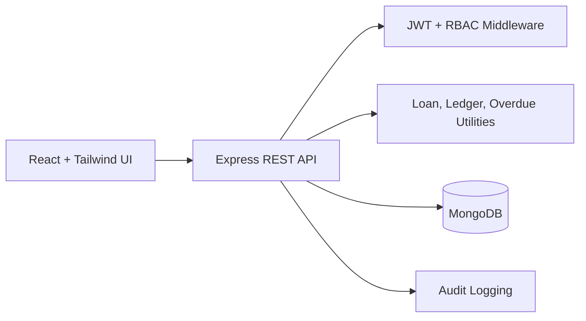

# Hope: Transparent Microfinance Loan Management System

## Introduction

Hope is a full-stack MVP web application for digitizing a realistic microfinance loan workflow in Bangladesh. It uses React, Tailwind CSS, Express, MongoDB, JWT authentication, bcrypt password hashing, and role-based access control.

The MVP intentionally uses a mock payment review flow. It does not connect to banking APIs, SMS OTP, real NID verification, real payment gateways, GPS tracking, or credit scoring.

## Problem Statement

Many microfinance institutions still depend on manual borrower registration, application review, installment collection, ledger updates, and overdue follow-up. Manual workflows create delays, calculation errors, limited borrower transparency, and high dependency on field officers.

## Objectives

- Digitize borrower registration, profile creation, and demo verification.
- Provide predefined loan products and a controlled application workflow.
- Generate repayment schedules automatically after approval.
- Let borrowers submit mock installment payments for admin/supervisor approval.
- Show a transparent ledger with paid, due, overdue, and remaining balances.
- Detect overdue installments and assign cases to field officers.
- Provide role-based dashboards for Borrower, Field Officer, Supervisor, and Admin.

## Scope

Included:

- JWT auth and role middleware
- Borrower profile verification
- Loan products
- Loan application approval/rejection
- Loan and installment generation
- Mock payments, payment approval, receipts
- Borrower ledger
- Overdue detection
- Field officer case assignment and visit logs
- Audit logs
- Seed data for demos

Excluded:

- Real payment gateway
- Real NID verification
- SMS OTP
- Banking APIs
- GPS routing
- AI credit scoring
- Complex branch accounting

## Target Users

- Borrower
- Field Officer
- Supervisor
- Admin

## Tech Stack

| Layer | Technology |
| --- | --- |
| Frontend | React, Vite, Tailwind CSS, React Router, Axios, Lucide icons |
| Backend | Node.js, Express.js |
| Database | MongoDB with Mongoose |
| Auth | JWT, bcryptjs |
| Architecture | Separated `frontend/` and `backend/` apps |

## Project Structure

```text
hope/
  backend/
    src/
      config/
      middleware/
      models/
      routes/
      seed/
      utils/
  frontend/
    src/
      api/
      components/
      context/
      pages/
      utils/
  docs/
    diagrams.md
    test-scenarios.md
```

## Setup

Install dependencies:

```bash
npm run install:all
```

Start MongoDB locally or set `backend/.env` `MONGO_URI` to a MongoDB Atlas connection string.

Backend environment:

```bash
cp backend/.env.example backend/.env
```

Frontend environment:

```bash
cp frontend/.env.example frontend/.env
```

Seed demo data:

```bash
npm run seed
```

Run backend:

```bash
npm run dev:backend
```

Run frontend:

```bash
npm run dev:frontend
```

Default local URLs:

- Frontend: `http://localhost:5173`
- Backend API: `http://localhost:5000/api`

## Demo Accounts

After `npm run seed`:

| Role | Email | Password |
| --- | --- | --- |
| Admin | `admin@hope.local` | `Admin123!` |
| Supervisor | `supervisor@hope.local` | `Admin123!` |
| Field Officer 1 | `officer1@hope.local` | `Admin123!` |
| Field Officer 2 | `officer2@hope.local` | `Admin123!` |
| Borrower | `ayeshashop@hope.local` | `Borrower123!` |
| Borrower | `mizan@hope.local` | `Borrower123!` |
| Borrower | `sharmin@hope.local` | `Borrower123!` |

## Functional Requirements

- Borrowers can register, complete profile, apply for loans, submit mock payments, view schedules, ledgers, and receipts.
- Field officers can view only assigned overdue cases, update case status, and submit visit logs.
- Supervisors can review loan applications, verify borrowers, review mock payments, assign overdue cases, and monitor field activity.
- Admins can manage users, roles, loan products, borrower verification, loan/payment approvals, overdue cases, and audit logs.

## Non-Functional Requirements

- Responsive mobile-friendly UI
- Modular backend routing and models
- Environment-based configuration
- Password hashing
- JWT-secured API routes
- Role-based access checks
- Basic validation and error handling
- Seedable demo data

## Business Rules

- Only borrowers can apply for loans.
- Borrowers must complete a profile before applying.
- Borrowers must be verified before approval.
- A borrower cannot have more than one active loan.
- Requested amount must be within product limits.
- Loan approval creates the active loan and repayment schedule.
- Payment remains pending until approved.
- Ledger totals use approved payments only.
- Overdue installments are unpaid installments with due dates before the current date.
- Field officers can only access assigned cases.

## Main API Endpoints

Authentication:

- `POST /api/auth/register`
- `POST /api/auth/login`
- `GET /api/auth/me`

Core workflow:

- `POST /api/borrowers/profile`
- `PATCH /api/borrowers/:id/verify`
- `GET /api/loan-products`
- `POST /api/loan-applications`
- `PATCH /api/loan-applications/:id/approve`
- `PATCH /api/loan-applications/:id/reject`
- `GET /api/installments/my`
- `PATCH /api/installments/update-overdue`
- `POST /api/payments`
- `PATCH /api/payments/:id/approve`
- `PATCH /api/payments/:id/reject`
- `GET /api/ledger/my`
- `GET /api/receipts/my`
- `POST /api/cases/assign`
- `GET /api/cases/assigned-to-me`
- `POST /api/visit-logs`
- `GET /api/audit-logs`

## System Architecture



## Database Schema

Models:

- User
- BorrowerProfile
- LoanProduct
- LoanApplication
- Loan
- Installment
- Payment
- Receipt
- OverdueCase
- VisitLog
- AuditLog

See [docs/diagrams.md](docs/diagrams.md) for ER, use case, class, activity, sequence, and UI mockup diagrams.

## Test Cases

See [docs/test-scenarios.md](docs/test-scenarios.md) for documented test scenarios covering registration, login, borrower profile, product creation, application approval, schedule generation, mock payment, ledger update, overdue detection, case assignment, visit logging, and role-based access control.

## Deployment Guide

1. Create production MongoDB database.
2. Set backend environment variables:
   - `PORT`
   - `MONGO_URI`
   - `JWT_SECRET`
   - `JWT_EXPIRES_IN`
   - `CLIENT_URL`
3. Set frontend environment variable:
   - `VITE_API_URL`
4. Build frontend:
   ```bash
   npm --prefix frontend run build
   ```
5. Start backend:
   ```bash
   npm --prefix backend run start
   ```
6. Serve `frontend/dist` from a static host such as Netlify, Vercel, or Nginx.

## Future Enhancements

- Branch-level reporting
- Exportable PDF statements
- SMS notification integration
- More detailed repayment rules
- Complaint/dispute module
- Offline-first field officer workflow
- Advanced analytics after core workflow is stable
