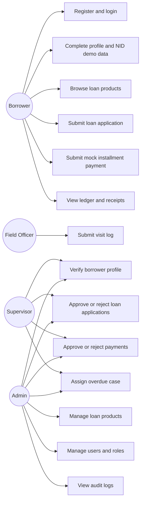
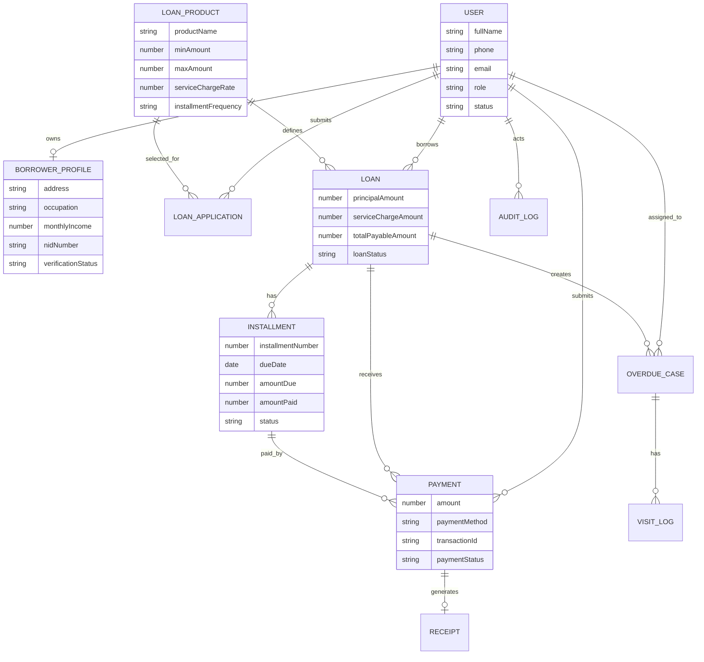
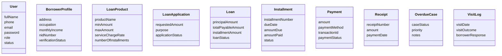
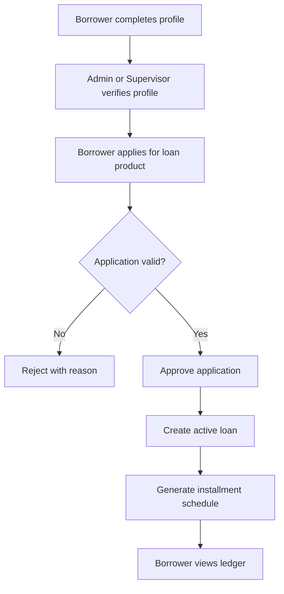
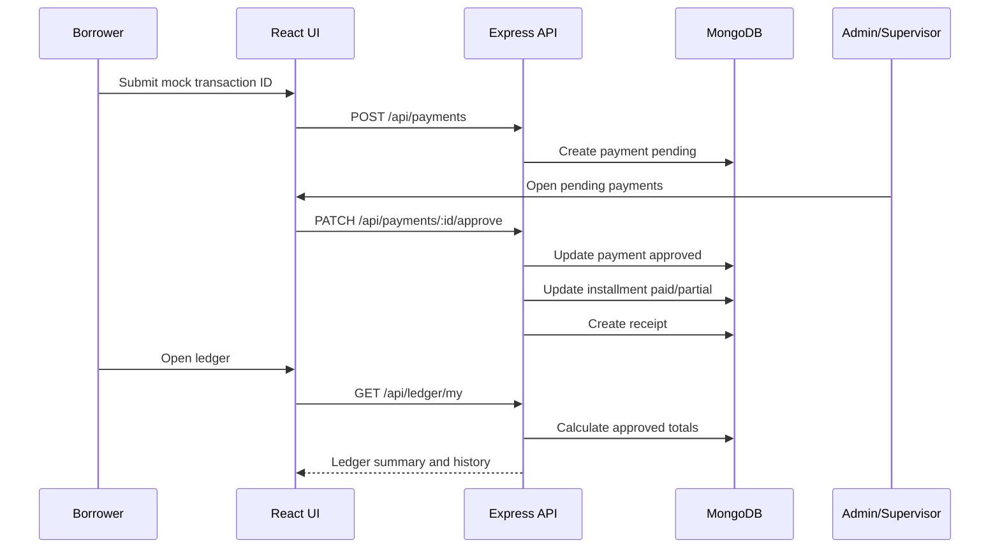

# Hope MVP Diagrams

## Use Case Diagram



## ER Diagram



## Class Diagram



## Activity Diagram: Loan Approval



## Sequence Diagram: Mock Payment



## UI Mockups

```text
Borrower Dashboard
+-----------------------------------------------------+
| Verification | Total Payable | Paid | Remaining     |
| Loan summary | Payment form for selected installment |
| Repayment schedule table                            |
+-----------------------------------------------------+

Supervisor Dashboard
+-----------------------------------------------------+
| Borrowers | Active Loans | Pending Apps | Cases      |
| Borrower verification table                         |
| Loan application review table                       |
| Pending payment review cards                        |
| Overdue assignment form + recent cases              |
+-----------------------------------------------------+

Field Officer Dashboard
+-----------------------------------------------------+
| Assigned | Open | Urgent                             |
| Case list              | Case details + visit log    |
+-----------------------------------------------------+
```
