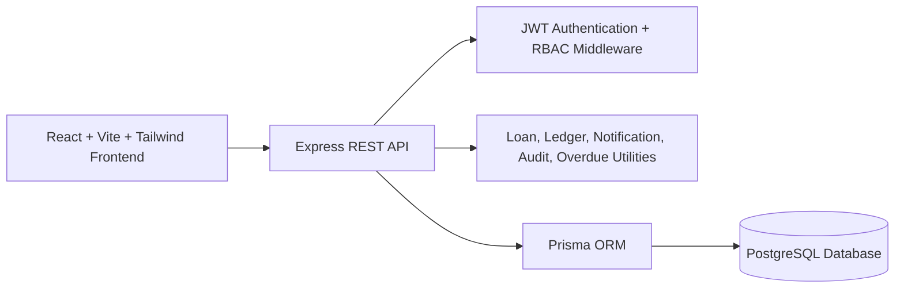
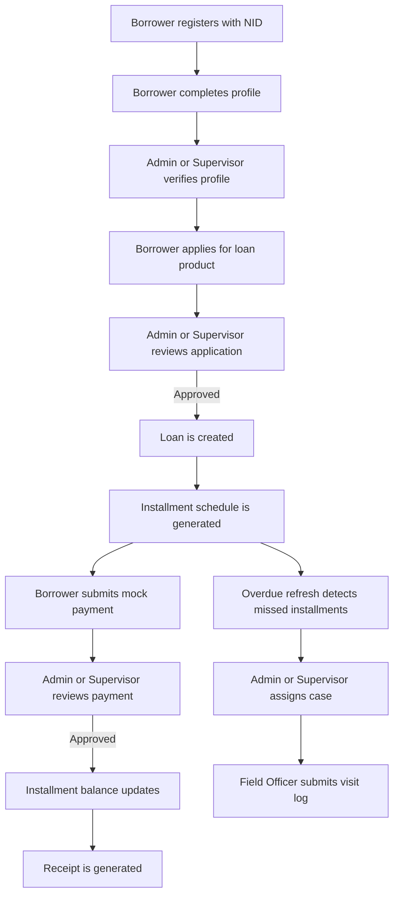
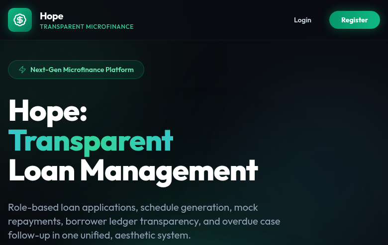
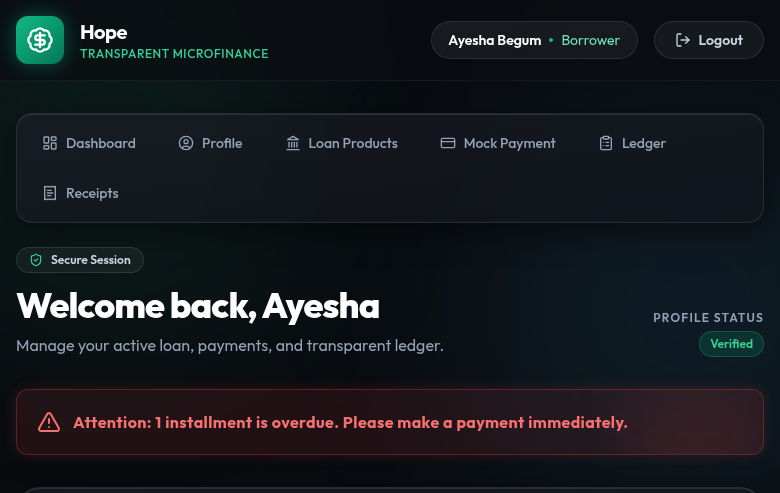
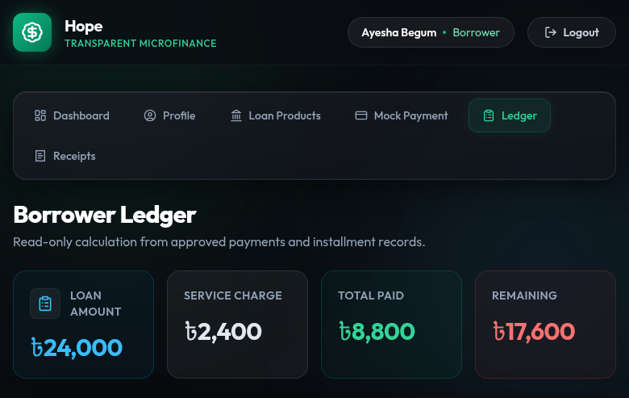
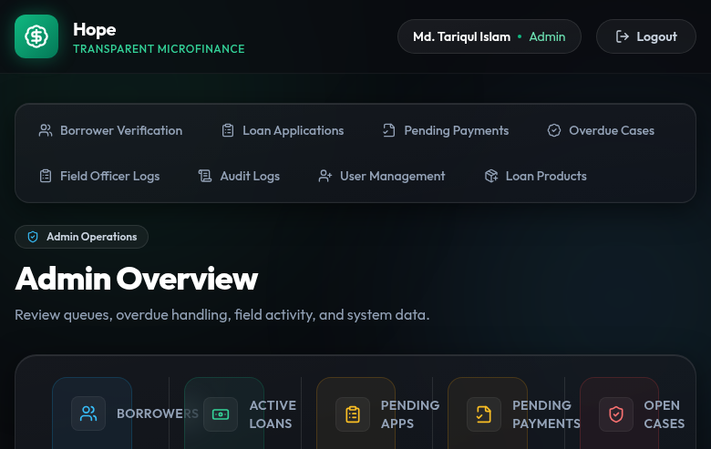
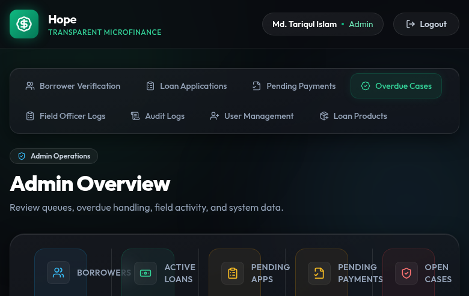

# Hope: Transparent Microfinance Loan Management Web Application

**Software Development Project Report**  
**Course:** CSE 3208, Software Development Project  
**Institution:** Bangladesh University of Professionals, Department of Computer Science and Engineering  
**Project Type:** Full-stack web application MVP  
**Date:** 20 May 2026

## Submitted By

| Name | ID |
| --- | --- |
| Abdul Hakim Shifat | 23524202129 |
| SM Shahrier Emon | 23524202095 |
| MD Mainul Islam | 23524202047 |
| Sarowar Rony | 23524202051 |

## Table of Contents

1. Introduction
2. Project Idea
3. Features of the Project
4. Design of the Project
5. Development of the Project
6. Overview of the Project
7. Contribution
8. Conclusion
9. Appendix

## Introduction

Hope is a full-stack web application developed to digitize microfinance loan management for borrowers, field officers, supervisors, and administrators. The system reduces manual paperwork by handling borrower registration, profile verification, loan product management, loan application review, installment tracking, mock payment review, receipts, ledger visibility, and overdue case follow-up through a single platform. It is designed for the Bangladeshi microfinance context, where transparency, field activity tracking, and clear borrower communication are important. The project is implemented as a minimum viable product, so it uses mock payment verification instead of real banking, SMS, NID, or payment gateway integration.

## Project Idea

The submitted project idea was to build **Hope**, a transparent microfinance loan management system that helps microfinance institutions manage borrower onboarding, loan approval, installment collection, ledger tracking, and overdue follow-up digitally. In the proposed workflow, borrowers register with required identity information, complete a profile, apply for predefined loan products, submit mock installment payments, and view a clear ledger of their loan progress. Supervisors and administrators verify borrower profiles, approve or reject loan applications, review submitted payments, monitor overdue installments, assign overdue cases to field officers, and review audit records. Field officers handle only the overdue cases assigned to them and submit visit logs after borrower follow-up.

The implemented project follows this idea as a working full-stack MVP. It includes JWT authentication, role-based access control, borrower NID validation, borrower document upload preview, borrower profile resubmission, loan products, loan applications, approval-based loan creation, automatic installment schedule generation, borrower ledgers, mock payment submission, payment approval and rejection, receipt generation, overdue detection, case assignment, field officer visit logs, notifications, audit logging, public landing-page statistics, light/dark theme support, and seeded demo data. The project intentionally excludes real payment gateways, real government NID verification, SMS OTP, banking APIs, GPS routing, AI credit scoring, and complex branch accounting.

## Features of the Project

| Area | Implemented Features |
| --- | --- |
| Public Pages | Home page, about page, public platform statistics, login, and borrower registration. |
| Authentication | JWT login, registration, authenticated user loading, protected routes, password hashing with bcryptjs, and account status checks. |
| Role-Based Access | Separate access for Borrower, Field Officer, Supervisor, and Admin using backend authorization middleware and frontend protected routes. |
| Borrower Registration | Borrower account creation with full name, phone, optional email, password, and required NID number. |
| NID Validation | NID must contain only numbers and must be exactly 13, 15, or 17 digits. |
| Borrower Profile | Borrowers can create or update profile information including address, occupation, monthly income, NID, nominee details, and NID document preview. |
| Profile Verification | Admins and supervisors can verify or reject borrower profiles with verification notes. Updated borrower profiles return to pending verification. |
| Loan Products | Admins can create, edit, enable, and disable loan products with amount limits, service charge rate, duration, installment frequency, number of installments, late fee, and eligibility notes. |
| Loan Applications | Borrowers can apply for active loan products; admins and supervisors can approve or reject pending applications. |
| Loan Creation | Approved applications create an active loan and generate the repayment schedule automatically. |
| Business Rules | A borrower must have a complete profile before applying, must be verified before approval, and cannot have more than one active loan. |
| Installments | The system tracks installment due dates, due amounts, paid amounts, statuses, and overdue state. |
| Mock Payment Flow | Borrowers submit installment payments using mock payment methods such as bKash, Nagad, Rocket, Card, or Cash Assist. |
| Payment Review | Admins and supervisors review pending payments, approve valid submissions, reject invalid submissions, update installment balances, and notify borrowers. |
| Partial Payment Support | Approved payments can partially pay an installment when the payment is less than the remaining installment amount. |
| Receipt Generation | Approved payments generate receipt records with receipt number, payment method, transaction ID, date, borrower, installment, and approver information. |
| Borrower Ledger | Borrowers can view loan amount, service charge, total payable, total paid, remaining balance, due amount, overdue amount, next due date, installment list, payments, and receipts. |
| Overdue Detection | The backend refreshes overdue installments and marks unpaid past-due installments as overdue. |
| Overdue Case Assignment | Admins and supervisors can assign overdue installments to active field officers with priority and notes. |
| Field Officer Workflow | Field officers view assigned cases, update case status, and submit visit logs with outcome, borrower response, next follow-up date, and notes. |
| Notifications | Users receive in-app notifications for profile actions, loan approval, payment review, overdue case assignment, and follow-up events. |
| Audit Logs | Important actions such as profile changes, loan product changes, application review, payment review, case assignment, and visit log submission are recorded. |
| User Management | Admins can create users and update user role or account status. |
| Dashboard UI | Role-specific dashboards show borrower tasks, field officer cases, supervisor review queues, and admin operations. |
| UI Improvements | Responsive layout, light/dark theme toggle, animated page transitions, NProgress loading bar, reusable status badges, stat cards, and empty-state components. |
| Demo Data | Seed script creates realistic Bangladeshi demo users, borrower profiles, loan products, applications, loans, installments, payments, receipts, overdue cases, visit logs, audit logs, and notifications. |

## Design of the Project

### System Architecture

Hope follows a client-server architecture. The frontend is a React application built with Vite and Tailwind CSS. The backend is a Node.js and Express REST API. Data is stored in PostgreSQL and accessed through Prisma ORM with the Prisma PostgreSQL adapter.



### Frontend Design

The frontend is organized around reusable components and role-based pages. The main router defines public routes for the home, about, login, and registration pages. Protected borrower routes include dashboard, profile, loan products, mock payment, ledger, receipts, and receipt detail pages. Protected field officer routes include the assigned cases dashboard. Supervisor and admin routes include borrower verification and loan application review, while the operations dashboard provides tabs for payments, overdue cases, field logs, audit logs, user management, and loan product management based on role.

The interface uses a responsive dashboard layout with a sticky header, navigation links based on the authenticated user's role, notification bell, theme toggle, glass-style panels, status badges, stat cards, and mobile-friendly navigation. Borrower screens emphasize clarity and transparency by showing profile status, active loan information, payment options, installment progress, ledger summary, and receipts. Admin and supervisor screens are designed as operational review panels for queues, approvals, case assignment, user management, loan product management, and audit monitoring.

### Backend Design

The backend is divided into configuration, middleware, route modules, utilities, and seed data. `app.js` registers security middleware, JSON parsing, CORS, logging, health check, and REST route modules. `server.js` connects Prisma to PostgreSQL, creates a default admin if no admin exists, starts the API server, and handles graceful shutdown.

Backend middleware protects routes with JWT authentication and role authorization. Route files handle authentication, users, borrowers, loan products, loan applications, loans, installments, payments, ledger, receipts, overdue cases, visit logs, audit logs, statistics, and notifications. Utility modules handle asynchronous error wrapping, loan calculations, overdue refresh, audit writing, and notification creation.

### Database Design

The project uses PostgreSQL with Prisma ORM. The Prisma schema defines enums for user roles, user status, verification status, installment status, loan frequency, loan status, application status, product status, notification type, case status, priority, payment method, and payment status.

| Entity | Purpose |
| --- | --- |
| User | Stores account identity, contact information, password hash, role, and account status. |
| BorrowerProfile | Stores borrower address, occupation, income, NID, document URL, nominee details, verification status, verifier, and verification notes. |
| LoanProduct | Defines available loan products, amount limits, service charge, duration, frequency, installments, late fee, eligibility note, and active/inactive status. |
| LoanApplication | Stores borrower loan requests, selected product, requested amount, purpose, status, rejection reason, reviewer, and review date. |
| Loan | Stores approved loan information, principal amount, service charge, total payable, frequency, installments, dates, status, borrower, product, and approver. |
| Installment | Stores repayment schedule items with due date, amount due, amount paid, status, paid date, borrower, loan, payments, receipts, and overdue cases. |
| Payment | Stores mock payment submissions, method, transaction ID, status, approver, approval date, and rejection reason. |
| Receipt | Stores approved payment receipt information including receipt number, borrower, loan, installment, amount, method, transaction ID, date, and approver. |
| OverdueCase | Tracks overdue follow-up assigned to field officers with borrower, loan, installment, priority, status, notes, assignment date, and resolution date. |
| VisitLog | Records field officer visits with case, officer, visit date, outcome, borrower response, next follow-up date, and notes. |
| AuditLog | Maintains accountability records for sensitive actions, actor, role, target, description, and timestamp. |
| Notification | Stores user-facing notifications with title, message, type, link, read status, and timestamp. |

### Use Case Summary

| User Role | Main Use Cases |
| --- | --- |
| Borrower | Register, login, complete profile, upload NID preview, apply for loans, submit mock payments, view ledger, view receipts, and receive notifications. |
| Field Officer | View assigned overdue cases, view case visit history, submit visit logs, update assigned case status, and receive case notifications. |
| Supervisor | Verify borrowers, review loan applications, review payments, assign overdue cases, view field logs, and view audit logs. |
| Admin | Perform all supervisor actions, manage users, manage loan products, update user roles/statuses, and monitor system operations. |

### Core Workflow



## Development of the Project

The project was implemented as a full-stack MVP with separate `frontend` and `backend` applications. Requirements were converted into role-specific workflows for borrowers, field officers, supervisors, and admins. The backend was developed with Express route modules, JWT authentication middleware, Prisma database access, and utility functions for loan calculation, overdue refresh, audit logging, and notifications. The PostgreSQL schema was modeled with Prisma entities for users, borrower profiles, products, applications, loans, installments, payments, receipts, overdue cases, visit logs, audit logs, and notifications. Business rules were added to prevent incomplete borrower applications, unverified borrower approvals, duplicate active loans, invalid payment amounts, duplicate pending payments, and unauthorized case access. Seed data was created to demonstrate realistic users, loan products, approved and pending applications, active loans, paid installments, pending payments, overdue cases, visit logs, audit logs, and notifications. The frontend was built with React, Vite, Tailwind CSS, React Router, Axios, Lucide icons, NProgress, and context providers for authentication and theme state. API-connected pages were built for borrower profile, product browsing, loan applications, dashboard summaries, payment submission, ledger, receipts, field officer cases, borrower verification, and operational review queues. The interface was refined with responsive navigation, dark/light theme support, reusable UI components, status badges, stat cards, error states, and document preview for NID upload. The frontend was checked through local production build verification, and the backend includes seed data for demo workflows.

### Development Tools, Languages, and Software

| Category | Tools / Languages / Software Used |
| --- | --- |
| Frontend Language | JavaScript, JSX, HTML5, CSS3 |
| Frontend Framework | React 18 with Vite |
| Frontend Styling | Tailwind CSS, custom CSS variables, responsive utility classes |
| Frontend Routing | React Router DOM |
| API Client | Axios |
| Frontend UI Support | Lucide React icons, NProgress loading bar |
| State Management | React Context for authentication and theme state |
| Backend Language | JavaScript running on Node.js |
| Backend Framework | Express.js |
| Database | PostgreSQL |
| ORM / Database Client | Prisma ORM, `@prisma/client`, `@prisma/adapter-pg`, `pg` |
| Authentication | JSON Web Token and bcryptjs |
| Backend Middleware | Helmet, CORS, Morgan, custom auth middleware, custom error handler |
| Development Tools | npm, Visual Studio Code, local terminal, Git |
| Demo / Testing Support | Prisma seed script, browser testing, frontend production build |

## Overview of the Project

This section presents selected screenshots from the developed project. The screenshots are stored in `docs/report-assets/`.

### Figure 1: Public Home Page



The public home page introduces the Hope platform and shows the purpose of transparent, role-based microfinance loan management. It also loads public platform statistics from the backend API.

### Figure 2: Borrower Dashboard



The borrower dashboard gives borrowers a centralized view of profile status, loan summary, active loan details, payment actions, and repayment schedule information.

### Figure 3: Borrower Ledger



The borrower ledger presents loan amount, service charge, total payable, total paid, remaining balance, due amount, overdue amount, next due date, installment history, payment history, and receipt records.

### Figure 4: Admin Loan Application Review



The admin and supervisor loan application screen allows authorized users to review borrower applications and approve or reject requests according to profile verification and loan product rules.

### Figure 5: Overdue Case Management



The overdue case management workflow allows supervisors and admins to identify overdue installments, assign cases to field officers, set priority, add notes, and track case status.

## Contribution

| Member Name | ID | Contribution |
| --- | --- | --- |
| Abdul Hakim Shifat | 23524202129 | Led requirement analysis and project planning; designed the backend workflow for authentication, borrower verification, loan applications, loan approval, installment generation, payment review, ledger calculation, and role-based access; coordinated final integration and documentation updates. |
| SM Shahrier Emon | 23524202095 | Developed and refined frontend pages including home, login, registration, borrower dashboard, borrower profile, loan products, mock payment, ledger, receipts, and responsive navigation; improved UI states, validation messages, theme behavior, and API-connected borrower workflows. |
| MD Mainul Islam | 23524202047 | Worked on database design and backend data modeling with Prisma for users, borrower profiles, loan products, applications, loans, installments, payments, receipts, overdue cases, visit logs, audit logs, and notifications; supported seed data and demo workflow preparation. |
| Sarowar Rony | 23524202051 | Contributed operations workflow testing, dashboard usability review, screenshot preparation, borrower/supervisor/admin/field officer scenario validation, bug reporting, and final report content review. |

## Conclusion

Hope demonstrates how a microfinance institution can digitize borrower onboarding, loan application review, repayment tracking, ledger transparency, mock payment verification, overdue follow-up, and field officer activity within one role-based web platform. The project fulfills the core submitted idea by providing borrower-facing transparency and institution-facing operational control. The current implementation uses React, Express, PostgreSQL, Prisma, JWT, and Tailwind CSS to provide a working MVP with realistic demo data and formal workflow separation. Future development can extend the system with real payment gateways, real NID verification, SMS or OTP services, document storage, branch-level accounting, deployment, analytics, and stronger production security controls.

## Appendix

### Project Structure

```text
Hope---Transparent-MicroFinance/
  backend/
    prisma/
      schema.prisma
      prisma.config.ts
    src/
      app.js
      server.js
      config/
      middleware/
      routes/
      seed/
      utils/
  frontend/
    src/
      api/
      assets/
      components/
      context/
      pages/
      utils/
    tailwind.config.js
    vite.config.js
  docs/
    report-assets/
    final-project-report.md
    final-project-report.pdf
    diagrams.md
    test-scenarios.md
```

### Main API Endpoints

| Module | Endpoints |
| --- | --- |
| Authentication | `POST /api/auth/register`, `POST /api/auth/login`, `GET /api/auth/me` |
| Users | `GET /api/users`, `POST /api/users`, `PATCH /api/users/:id/status`, `PATCH /api/users/:id/role` |
| Borrowers | `GET /api/borrowers`, `GET /api/borrowers/me`, `POST /api/borrowers/profile`, `PATCH /api/borrowers/profile`, `PATCH /api/borrowers/:id/verify` |
| Loan Products | `GET /api/loan-products`, `POST /api/loan-products`, `PATCH /api/loan-products/:id`, `PATCH /api/loan-products/:id/status` |
| Loan Applications | `POST /api/loan-applications`, `GET /api/loan-applications`, `GET /api/loan-applications/my`, `PATCH /api/loan-applications/:id/approve`, `PATCH /api/loan-applications/:id/reject` |
| Loans | `GET /api/loans`, `GET /api/loans/my`, `GET /api/loans/:id` |
| Installments | `GET /api/installments/my`, `GET /api/installments/loan/:loanId`, `PATCH /api/installments/update-overdue` |
| Payments | `POST /api/payments`, `GET /api/payments/my`, `GET /api/payments/pending`, `PATCH /api/payments/:id/approve`, `PATCH /api/payments/:id/reject` |
| Ledger | `GET /api/ledger/my`, `GET /api/ledger/:borrowerId` |
| Receipts | `GET /api/receipts/my`, `GET /api/receipts/:id` |
| Overdue Cases | `POST /api/cases/assign`, `GET /api/cases`, `GET /api/cases/assigned-to-me`, `PATCH /api/cases/:id/status` |
| Visit Logs | `POST /api/visit-logs`, `GET /api/visit-logs`, `GET /api/visit-logs/case/:caseId` |
| Audit Logs | `GET /api/audit-logs` |
| Notifications | `GET /api/notifications/my`, `PATCH /api/notifications/:id/read`, `PATCH /api/notifications/read-all` |
| Public Statistics | `GET /api/stats/public` |

### Demo Accounts

After running the seed script, the following accounts are available:

| Role | Email | Password | Notes |
| --- | --- | --- | --- |
| Admin | `admin@hope.bd` | `Admin123!` | Full system access. |
| Supervisor | `supervisor@hope.bd` | `Admin123!` | Review and operations access. |
| Field Officer | `rahim.fo@hope.bd` | `Officer123!` | Assigned urgent overdue case. |
| Field Officer | `kamal.fo@hope.bd` | `Officer123!` | Assigned normal overdue case. |
| Borrower | `ayesha@hope.bd` | `Borrower123!` | Active loan with pending payment. |
| Borrower | `mizan@hope.bd` | `Borrower123!` | Active loan with paid installments. |
| Borrower | `sharmin@hope.bd` | `Borrower123!` | Active loan with overdue installments. |
| Borrower | `jamal@hope.bd` | `Borrower123!` | Pending loan application. |
| Borrower | `rashida@hope.bd` | `Borrower123!` | Pending loan application. |
| Borrower | `kobir@hope.bd` | `Borrower123!` | Rejected borrower profile. |

### Setup and Run Commands

```bash
npm run install:all
```

Create backend environment file:

```bash
cp backend/.env.example backend/.env
```

Create frontend environment file:

```bash
cp frontend/.env.example frontend/.env
```

Seed the database:

```bash
npm run seed
```

Run the backend:

```bash
npm run dev:backend
```

Run the frontend:

```bash
npm run dev:frontend
```

Default local URLs:

| Service | URL |
| --- | --- |
| Frontend | `http://localhost:5173` |
| Backend API | `http://localhost:5000/api` |

### Scope Limitations

| Not Included in MVP | Reason |
| --- | --- |
| Real payment gateway | The project uses mock payment submission and manual approval for demonstration. |
| Real NID verification | NID validation checks format only; no external government verification service is connected. |
| SMS OTP | Authentication is handled by password and JWT only. |
| Banking APIs | Loan disbursement and repayment are simulated inside the application workflow. |
| GPS tracking | Field officer activity is tracked through visit logs, not live location. |
| AI credit scoring | Borrower eligibility is handled through profile verification and product rules. |
| Complex branch accounting | The MVP focuses on loan workflow transparency rather than full accounting operations. |
